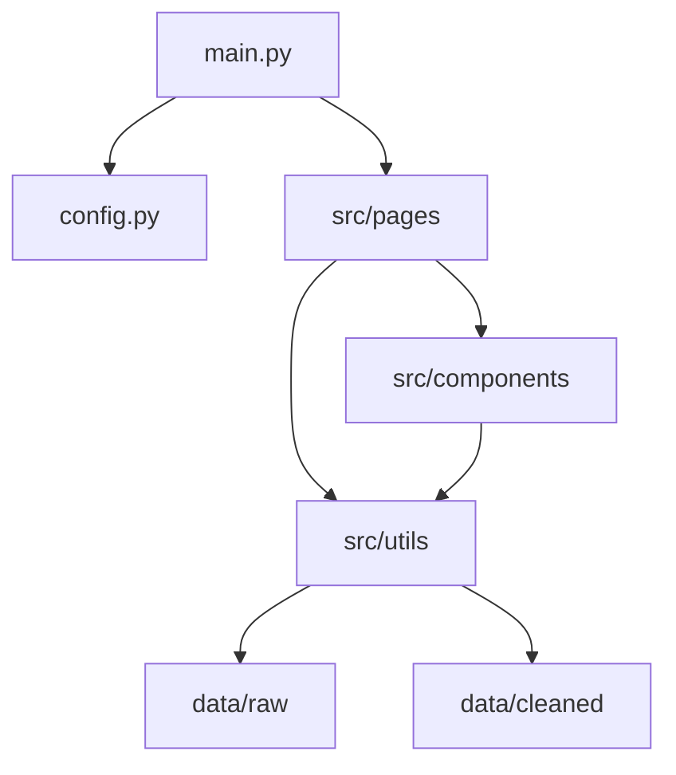

# 中国股市数据分析平台

基于 Dash 框架的交互式股市数据分析和可视化平台，提供沪深两市指数分析、融资融券数据分析以及相关性分析功能。

## User Guide

### 安装依赖

本项目需要 Python 3.8 或更高版本。首先安装所需的 Python 包：

```bash
python -m pip install -r requirements.txt
```

### 运行应用

在项目根目录下运行以下命令启动 Dashboard：

```bash
python main.py
```

应用启动后，在浏览器中访问 `http://127.0.0.1:8050` 即可使用。

### 使用说明

Dashboard 包含以下四个主要页面：

1. **首页**: 展示项目简介和功能模块导航
2. **指数分析**: 提供上证指数和深证成指的日线、周线、月线 K 线图及趋势分析
3. **融资融券分析**: 展示沪深两市融资融券余额趋势、变化率及详细组成分析
4. **相关性分析**: 分析上证指数与深证成指之间的价格相关性、收益率相关性和动态相关性

## Data

### 数据来源

本项目使用的数据包括：

- `sh_index.csv`: 上证指数历史数据（1990-至今）
- `sz_index.csv`: 深证成指历史数据（1991-至今）
- `sh_margin_trade.csv`: 沪市融资融券数据（2010-至今）
- `sz_margin_trade.csv`: 深市融资融券数据（2010-至今）

**数据来源**: 阿里云天池公开数据集  
**数据集链接**: https://tianchi.aliyun.com/  
**用途**: 本数据集仅用于教学和学术研究目的

> 📄 详细的数据来源说明请参见 [DATA_SOURCE.md](DATA_SOURCE.md)

### 数据字段说明

**指数数据字段**:
- `date`: 交易日期（格式：YYYYMMDD）
- `open`: 开盘价
- `high`: 最高价
- `low`: 最低价
- `close`: 收盘价
- `vol`: 成交量
- `amount`: 成交额

**融资融券数据字段**:
- `date`: 交易日期（格式：YYYYMMDD）
- `financing_balance`: 融资余额
- `financing_purchase`: 融资买入额
- `financing_redeem`: 融资偿还额
- `securities_lending_balance`: 融券余额
- `securities_lending_sell`: 融券卖出量
- `margin_balance`: 融资融券余额（融资余额+融券余额）

### 数据处理

原始数据存储在 `data/raw/` 目录，经过清洗处理后的数据存储在 `data/cleaned/` 目录。数据处理包括：

- 日期格式转换
- 数据排序和索引重置
- 缺失值处理
- 计算衍生指标（涨跌幅、移动平均线等）
- 时间序列重采样（日线→周线/月线）

## Developer Guide

### 项目结构

```
data_project/
├── config.py                      # 配置文件
├── main.py                        # 主程序入口
├── requirements.txt               # 依赖包列表
├── README.md                      # 项目文档
├── data/                          # 数据目录
│   ├── raw/                       # 原始数据
│   │   ├── sh_index.csv
│   │   ├── sz_index.csv
│   │   ├── sh_margin_trade.csv
│   │   └── sz_margin_trade.csv
│   └── cleaned/                   # 清洗后的数据
│       ├── sh_index_clean.csv
│       ├── sz_index_clean.csv
│       ├── sh_margin_clean.csv
│       └── sz_margin_clean.csv
└── src/                           # 源代码
    ├── __init__.py
    ├── components/                # UI 组件
    │   ├── __init__.py
    │   ├── navbar.py              # 导航栏组件
    │   ├── index_charts.py        # 指数图表组件
    │   ├── margin_charts.py       # 融资融券图表组件
    │   └── correlation_charts.py  # 相关性图表组件
    ├── pages/                     # 页面
    │   ├── __init__.py
    │   ├── home.py                # 首页
    │   ├── index_analysis.py      # 指数分析页面
    │   ├── margin_analysis.py     # 融资融券分析页面
    │   └── correlation.py         # 相关性分析页面
    └── utils/                     # 工具函数
        ├── __init__.py
        ├── get_data.py            # 数据加载模块
        └── clean_data.py          # 数据清洗模块
```

### 架构说明

项目采用模块化设计，分为以下几个层次：

1. **数据层** (`src/utils/`): 负责数据的加载、清洗和处理
2. **组件层** (`src/components/`): 可复用的图表组件
3. **页面层** (`src/pages/`): 各个功能页面及其回调逻辑
4. **应用层** (`main.py`): 应用初始化和路由管理



### 添加新页面

1. 在 `src/pages/` 目录下创建新的页面文件，例如 `new_page.py`
2. 实现 `create_new_page()` 函数返回页面布局
3. 实现 `register_new_page_callbacks(app)` 函数注册回调
4. 在 `main.py` 中导入并注册新页面：
   ```python
   from src.pages.new_page import create_new_page, register_new_page_callbacks
   
   # 在 display_page 函数中添加路由
   elif pathname == '/new-page':
       return create_new_page()
   
   # 在 create_app 函数中注册回调
   register_new_page_callbacks(app)
   ```
5. 在 `src/components/navbar.py` 中添加导航链接

### 添加新图表

1. 在 `src/components/` 目录下相应的文件中添加新的图表函数
2. 图表函数应返回 `plotly.graph_objects.Figure` 对象
3. 在页面文件中导入并使用新图表函数
4. 通过回调函数实现交互功能

### 代码规范

- 所有函数都应包含 docstring 说明
- 使用类型提示（typing）增强代码可读性
- 遵循 PEP 8 编码规范
- 组件函数命名以 `create_` 开头
- 回调函数命名以 `update_` 或 `register_` 开头

## Rapport d'analyse

### 主要发现

1. **沪深指数相关性分析**
   - 上证指数与深证成指呈现强正相关关系（相关系数 > 0.9）
   - 两个指数在长期趋势上高度一致，反映了中国股市的整体性特征
   - 在某些时间段（如2015年股灾期间），相关性会出现短期波动

2. **融资融券趋势**
   - 融资融券余额整体呈上升趋势，反映了市场杠杆的增加
   - 融资余额远高于融券余额，表明市场参与者更倾向于做多
   - 余额变化率与市场情绪密切相关，在市场上涨期间余额增长加速

3. **市场特征**
   - 日线数据显示市场波动性较大，短期趋势难以预测
   - 周线和月线数据更能反映中长期趋势
   - 移动平均线能够有效地平滑短期波动，辅助趋势判断

### 可视化亮点

- **K线图**: 直观展示价格波动和交易量
- **热力图**: 清晰呈现融资融券的月度模式
- **滚动相关性**: 动态展示两市场相关性的时间变化
- **双轴对比图**: 方便比较不同量级的指标

## Copyright

### 原创性声明

本项目代码完全由项目开发者原创完成，包括：
- 项目架构设计
- 数据处理逻辑
- 可视化组件实现
- 页面布局和交互设计

### 参考资料

本项目在开发过程中参考了以下官方文档和资源：

1. **Dash 官方文档** (https://dash.plotly.com/)
   - 用途：学习 Dash 框架的基本使用方法和组件 API
   - 涉及文件：`main.py`, `src/pages/*.py`

2. **Plotly Python 文档** (https://plotly.com/python/)
   - 用途：学习 Plotly 图表的创建和配置方法
   - 涉及文件：`src/components/*_charts.py`

3. **Pandas 官方文档** (https://pandas.pydata.org/docs/)
   - 用途：数据处理和时间序列操作
   - 涉及文件：`src/utils/clean_data.py`

4. **Dash Bootstrap Components 文档** (https://dash-bootstrap-components.opensource.faculty.ai/)
   - 用途：使用 Bootstrap 风格的 UI 组件
   - 涉及文件：`src/components/navbar.py`, `src/pages/*.py`

所有代码均为根据以上文档学习后独立编写，未直接复制任何代码片段。

### 数据声明

本项目使用的数据来源于阿里云天池公开数据集平台（https://tianchi.aliyun.com/），所有数据均为公开数据集，仅用于教学和学术研究目的。数据的使用遵循阿里云天池平台的数据使用协议。

---

**项目开发**: ESIEE Paris - Python 2 Data Project  
**开发时间**: 2025年  
**技术栈**: Python, Dash, Plotly, Pandas, Bootstrap
=======
# data_project
data_project of python2
>>>>>>> 6668b385e97d8b1ddc543e318a736b80cb936690
