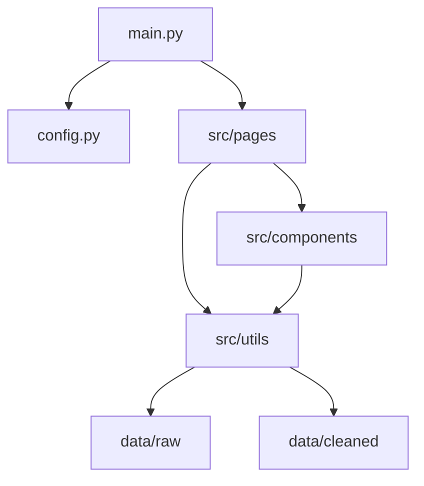

# China Stock Market Analysis Platform

An interactive stock market analysis and visualization platform based on the Dash framework, providing analysis of Shanghai and Shenzhen stock market indices, margin trading data, and correlation analysis.

## User Guide

### Install Dependencies

This project requires Python 3.8 or higher. First, install the required Python packages:

```bash
python -m pip install -r requirements.txt
```

### Run the Application

Run the following command in the project root directory to start the Dashboard:

```bash
python main.py
```

After the application starts, visit `http://127.0.0.1:8050` in your browser to use it.

### Usage Instructions

The Dashboard includes the following four main pages:

1.  **Home**: Displays the project introduction and navigation to functional modules.
2.  **Index Analysis**: Provides daily, weekly, and monthly K-line charts and trend analysis for the Shanghai Composite Index and Shenzhen Component Index.
3.  **Margin Trading Analysis**: Shows the trend of margin trading balance, rate of change, and detailed composition analysis for both Shanghai and Shenzhen markets.
4.  **Correlation Analysis**: Analyzes the price correlation, return correlation, and dynamic correlation between the Shanghai and Shenzhen indices.

## Data

### Data Source

The data used in this project includes:

- `sh_index.csv`: Historical data of the Shanghai Composite Index (1990-2022)
- `sz_index.csv`: Historical data of the Shenzhen Component Index (1991-2022)
- `sh_margin_trade.csv`: Margin trading data for the Shanghai market (2010-2022)
- `sz_margin_trade.csv`: Margin trading data for the Shenzhen market (2010-2022)

**Data Source**: Alibaba Cloud Tianchi Open Datasets  
**Dataset Link**: https://tianchi.aliyun.com/  
**Purpose**: This dataset is for educational and academic research purposes only.

### Data Field Description

**Index Data Fields**:
- `date`: Trading date (format: YYYYMMDD)
- `open`: Opening price
- `high`: Highest price
- `low`: Lowest price
- `close`: Closing price
- `vol`: Trading volume
- `amount`: Trading amount

**Margin Trading Data Fields**:
- `date`: Trading date (format: YYYYMMDD)
- `financing_balance`: Financing balance
- `financing_purchase`: Financing purchase amount
- `financing_redeem`: Financing redemption amount
- `securities_lending_balance`: Securities lending balance
- `securities_lending_sell`: Securities lending sell volume
- `margin_balance`: Margin trading balance (financing balance + securities lending balance)

### Data Processing

Raw data is stored in the `data/raw/` directory, and the cleaned data is stored in the `data/cleaned/` directory. Data processing includes:

- Date format conversion
- Data sorting and index resetting
- Handling missing values
- Calculating derived indicators (e.g., percentage change, moving averages)
- Time series resampling (daily → weekly/monthly)

## Developer Guide

### Project Structure

```
data_project/
├── config.py                      # Configuration file
├── main.py                        # Main application entry point
├── requirements.txt               # List of required packages
├── README.md                      # Project documentation
├── data/                          # Data directory
│   ├── raw/                       # Raw data
│   │   ├── sh_index.csv
│   │   ├── sz_index.csv
│   │   ├── sh_margin_trade.csv
│   │   └── sz_margin_trade.csv
│   └── cleaned/                   # Cleaned data
│       ├── sh_index_clean.csv
│       ├── sz_index_clean.csv
│       ├── sh_margin_clean.csv
│       └── sz_margin_clean.csv
└── src/                           # Source code
    ├── __init__.py
    ├── components/                # UI components
    │   ├── __init__.py
    │   ├── navbar.py              # Navbar component
    │   ├── index_charts.py        # Index chart components
    │   ├── margin_charts.py       # Margin trading chart components
    │   └── correlation_charts.py  # Correlation chart components
    ├── pages/                     # Pages
    │   ├── __init__.py
    │   ├── home.py                # Home page
    │   ├── index_analysis.py      # Index analysis page
    │   ├── margin_analysis.py     # Margin trading analysis page
    │   └── correlation.py         # Correlation analysis page
    └── utils/                     # Utility functions
        ├── __init__.py
        ├── get_data.py            # Data loading module
        └── clean_data.py          # Data cleaning module
```

### Architecture Description

The project uses a modular design, divided into the following layers:

1.  **Data Layer** (`src/utils/`): Responsible for loading, cleaning, and processing data.
2.  **Component Layer** (`src/components/`): Reusable chart components.
3.  **Page Layer** (`src/pages/`): Individual functional pages and their callback logic.
4.  **Application Layer** (`main.py`): Application initialization and routing management.



### Adding a New Page

1.  Create a new page file in the `src/pages/` directory, e.g., `new_page.py`.
2.  Implement a `create_new_page()` function that returns the page layout.
3.  Implement a `register_new_page_callbacks(app)` function to register callbacks.
4.  Import and register the new page in `main.py`:
    ```python
    from src.pages.new_page import create_new_page, register_new_page_callbacks
   
    # Add a route in the display_page function
    elif pathname == '/new-page':
        return create_new_page()
   
    # Register callbacks in the create_app function
    register_new_page_callbacks(app)
    ```
5.  Add a navigation link in `src/components/navbar.py`.

### Adding a New Chart

1.  Add a new chart function in the corresponding file in the `src/components/` directory.
2.  The chart function should return a `plotly.graph_objects.Figure` object.
3.  Import and use the new chart function in the page file.
4.  Implement interactive features through callback functions.

## Analysis Report

### Key Findings

1.  **Correlation Analysis of Shanghai and Shenzhen Indices**
    - The Shanghai and Shenzhen indices show a strong positive correlation (correlation coefficient > 0.9).
    - The two indices are highly consistent in long-term trends, reflecting the overall characteristics of the Chinese stock market.
    - During certain periods (such as the 2015 stock market crash), the correlation shows short-term fluctuations.

2.  **Margin Trading Trends**
    - The margin trading balance shows an overall upward trend, reflecting an increase in market leverage.
    - The financing balance is much higher than the securities lending balance, indicating that market participants are more inclined to be bullish.
    - The rate of change in the balance is closely related to market sentiment, with balance growth accelerating during market uptrends.

3.  **Market Characteristics**
    - Daily data shows high market volatility, making short-term trends difficult to predict.
    - Weekly and monthly data better reflect medium and long-term trends.
    - Moving averages can effectively smooth out short-term fluctuations and assist in trend judgment.

### Visualization Highlights

- **K-line Chart**: Intuitively displays price fluctuations and trading volume.
- **Heatmap**: Clearly presents the monthly patterns of margin trading.
- **Rolling Correlation**: Dynamically shows the time-varying correlation between the two markets.
- **Dual-axis Chart**: Convenient for comparing indicators of different magnitudes.

## Copyright

### Originality Statement

The code in this project was originally developed by the project developer, including:
- Project architecture design
- Data processing logic
- Visualization component implementation
- Page layout and interaction design

### References

During the development of this project, the following official documents and resources were consulted:

1.  **Dash Official Documentation** (https://dash.plotly.com/)
    - Purpose: To learn the basic usage of the Dash framework and its component APIs.
    - Files involved: `main.py`, `src/pages/*.py`

2.  **Plotly Python Documentation** (https://plotly.com/python/)
    - Purpose: To learn how to create and configure Plotly charts.
    - Files involved: `src/components/*_charts.py`

3.  **Pandas Official Documentation** (https://pandas.pydata.org/docs/)
    - Purpose: For data processing and time series operations.
    - Files involved: `src/utils/clean_data.py`

4.  **Dash Bootstrap Components Documentation** (https://dash-bootstrap-components.opensource.faculty.ai/)
    - Purpose: To use Bootstrap-style UI components.
    - Files involved: `src/components/navbar.py`, `src/pages/*.py`

All code was written independently after studying the above documents, and no code snippets were directly copied.

### Data Declaration

The data used in this project is from the Alibaba Cloud Tianchi open dataset platform (https://tianchi.aliyun.com/), and all data is from public datasets, intended for educational and academic research purposes only. The use of the data complies with the data usage agreement of the Tianchi platform.

---

**Project Development**: ESIEE Paris - Python 2 Data Project  
**Development Time**: 2025  
**Technology Stack**: Python, Dash, Plotly, Pandas, Bootstrap